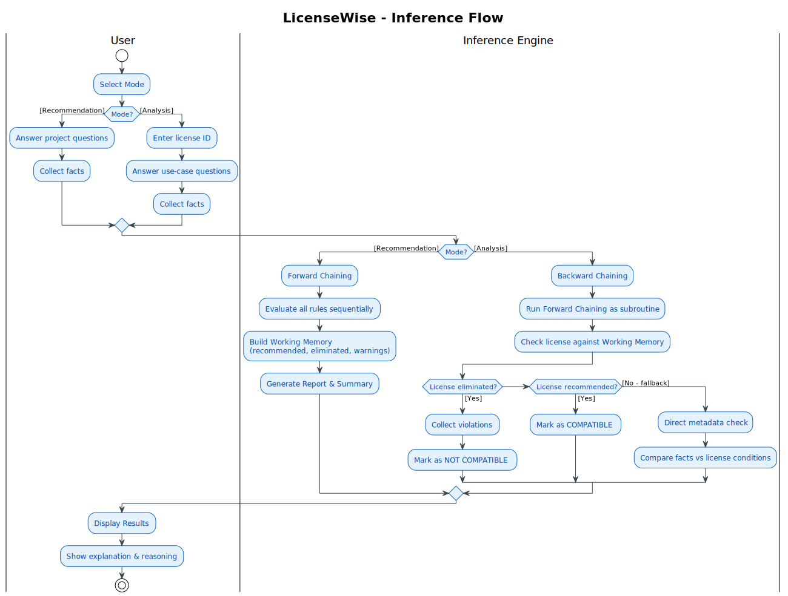

## inference

inference here is both forward and backward chain not at the same time but at different conditions

if using `CLI` or `GUI` and using "License Recommendation" that will fire ***Forward chaining***
if using "License Analysis" instead, ***fires Backward chaining***

