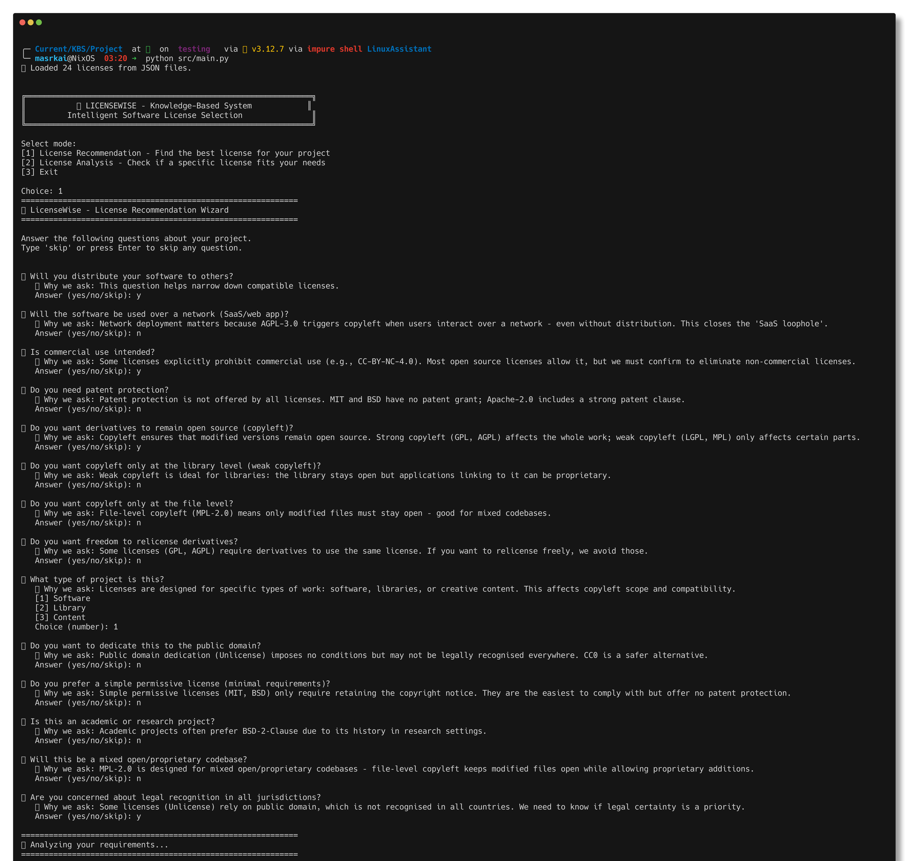
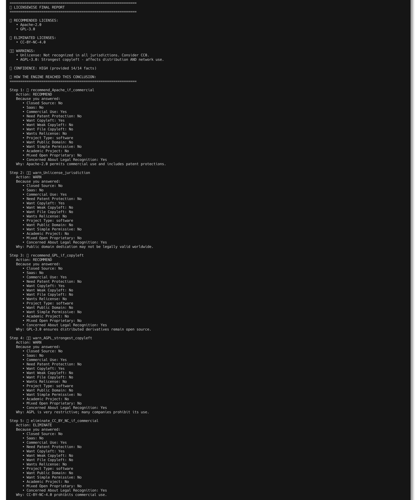
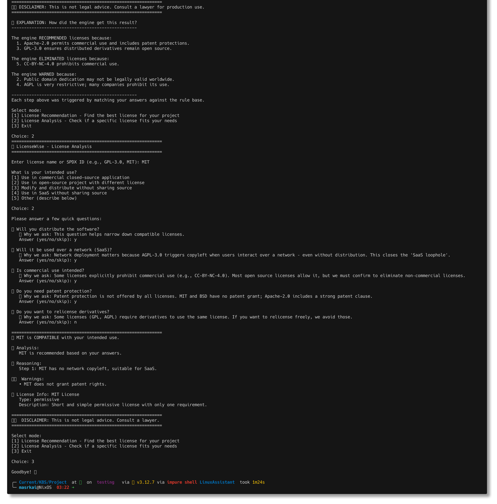

## Test Runs

### CLI (command line)

used:

- less utility
- termshot for terminal screenshot with `--raw-read`

### WebUI (Gradio WebUI)

[part 1](Test_run/GUI_1.pdf)
[part 2](Test_run/GUI_2.pdf)